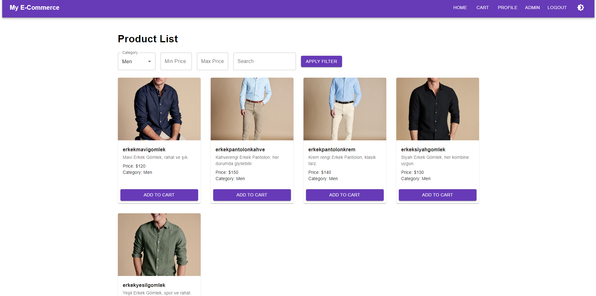

# E-Commerce Project

Welcome to our **E-Commerce Project**—a **full-stack** application with a **Monolithic** Node.js/Express backend, **microservices** for **Payment** and **Billing**, and a **React + Material-UI** frontend. It covers **user registration**, **product listing** with **filter/search**, **cart** functionality, **payments**, **invoice generation**, and an **admin** panel for managing products and users.

Below is an overview, setup instructions, screenshots, and references to all key features.

---

## **Table of Contents**
1. [Project Structure](#project-structure)
2. [Technologies Used](#technologies-used)
3. [Features](#features)
4. [Setup & Running](#setup--running)
5. [Screenshots](#screenshots)
6. [License](#license)

---


# Project Structure


```plaintext
ecommerce-project2/
├── .idea/                                # IDE configs (optional)
├── billing-service/
│   ├── node_modules/
│   ├── src/
│   │   ├── config/
│   │   ├── controllers/
│   │   ├── models/
│   │   ├── routes/
│   │   ├── app.js                        # Express app
│   │   └── index.js                      # Service entry point
│   ├── .env                              # Billing-specific environment variables
│   ├── Dockerfile
│   ├── package.json
│   └── package-lock.json
├── frontend/
│   ├── node_modules/
│   ├── public/
│   │   ├── images/                       # Product images or other static images
│   │   ├── screenshots/                  # Screenshots for documentation
│   │   └── index.html                    # Main entry for create-react-app
│   ├── src/
│   │   ├── components/                   # Reusable and feature-specific components
│   │   ├── layout/                       # Layout components (Navbar, Footer, etc.)
│   │   ├── pages/                        # Page-level components (Profile, Cart, Admin, etc.)
│   │   ├── services/                     # API services (axios setups)
│   │   ├── theme/                        # MUI theme files
│   │   ├── utils/                        # Utility/helper functions
│   │   ├── App.js                        # Main app routes
│   │   └── index.js                      # React DOM entry point
│   ├── Dockerfile
│   ├── package.json
│   └── package-lock.json
├── monolith/
│   ├── src/
│   │   ├── config/                       # Mongo, Redis, Kafka configs if any
│   │   ├── controllers/                  # userController, productController, etc.
│   │   ├── middlewares/                  # auth.js, adminAuth.js, error handlers
│   │   ├── models/                       # Mongoose schemas (User, Product, etc.)
│   │   ├── routes/                       # Express routes (userRoutes, productRoutes, etc.)
│   │   ├── seeds/                        # seedData.js, or seeding scripts
│   │   ├── services/                     # Additional logic or helpers
│   │   ├── app.js                        # Express app
│   │   └── index.js                      # Entry point, runs seed & starts server
│   ├── .env                              # Monolith env variables (JWT_SECRET, DB URIs, etc.)
│   ├── Dockerfile
│   ├── package.json
│   └── package-lock.json
├── payment-service/
│   ├── node_modules/
│   ├── src/
│   │   ├── config/                       # Kafka config if you use it
│   │   ├── app.js                        # Express app
│   │   └── index.js                      # Service entry point
│   ├── Dockerfile
│   ├── package.json
│   └── package-lock.json
├── .env                                  # Global or Docker-level environment vars
├── docker-compose.yml                    # Orchestrates all services (Mongo, Redis, Kafka, etc.)
└── Readme.md                             # Project README
```

## **Monolith**
Handles **user and product management**, **orders**, and proxies invoice requests to the **Billing** service.

## **Payment Service**
Processes payments (dummy or real). It can notify the **Billing** service (directly or via Kafka).

## **Billing Service**
Stores **invoices** for each payment/order. Provides routes for users (to see their invoices) and admins (to see all invoices).

## **Frontend**
A **React** application styled with **Material-UI** (MUI). It includes:
- Product **filter/search**
- **Cart** functionality
- **Login/Register** forms
- An **admin** panel for managing products/users and viewing all orders/invoices

---

## **Technologies Used**

- **Node.js + Express**
  - Monolith API (users, products, orders)
  - Payment microservice
  - Billing microservice

- **MongoDB**
  - Monolith DB (users, products, orders)
  - Billing DB (invoices)

- **Kafka** (Optional)
  - For asynchronous communication (e.g., `payment-completed` events).

- **React (Create React App) + Material-UI**
  - Provides a polished UI with product listing, filtering, cart, admin pages, etc.

- **Docker + Docker Compose**
  - Containerizes Monolith, Payment, Billing, and Frontend (+ Mongo, optionally Kafka/Zookeeper).

- **JWT** authentication
  - For user login, admin authorization, etc.

---

## **Features**

1. **User Registration**
  - Users register with `username`, `fullName`, `email`, `password`, plus an address object.

   

2. **Login & JWT**
  - Users login with **email + password**, receiving a JWT token for secure API requests.

   

3. **Product List + Filtering/Searching**
  - Filter by **price**, **category**, or use a **search** keyword (e.g., “gomlek”).
  - Example filtering by **Men** category:

   
   
   
4. **Cart**
  - “Add to Cart” on each product (localStorage or server-based).
  - A cart page shows items, total, etc.

   
   

5. **Payment** (Dummy or real logic)
  - Payment service (port `:4000`) handles `POST /pay`.
  - On success, optionally triggers invoice creation in Billing.

   
   


   

6. **Admin Panel**
  - Admin can create/update/delete products, see all orders/invoices, manage users, etc.

   

7. **Project Structure**

   


---

## **Setup & Running**

### 1) **Environment & Docker**
- Install **Docker** & **Docker Compose**.
- Clone this repo and navigate to the project root.

### 2) **Docker Compose**
In your **`docker-compose.yml`**, define each service:

```yaml
version: '3.8'
services:
  monolith:
    build: ./monolith
    ports:
      - "3000:3000"
    ...

  payment-service:
    build: ./payment-service
    ports:
      - "4000:4000"
    ...

  billing-service:
    build: ./billing-service
    ports:
      - "5000:5000"
    ...

  frontend:
    build: ./frontend
    ports:
      - "3001:3000"
    ...

  # plus mongo/kafka/zookeeper as needed
  than run : docker-compose up --build
```
* Monolith → http://localhost:3000/api
* Payment → http://localhost:4000
* Billing → http://localhost:5000
* Frontend → http://localhost:3001
3) Seed Data
   The monolith often has a seedData.js that creates:
   Admin (admin@example.com / admin123)
   User (user@example.com / user123)
   Products (gomlek, pantolon, electronics, etc.)
   Check Docker logs for “Default admin created” or “Initial products seeded.”

4) Open the App
   * Frontend at http://localhost:3001
   * Monolith at http://localhost:3000/api
   * Payment at http://localhost:4000
   * Billing at http://localhost:5000

* This project made by NewMindAi Fullstack Bootcamp Student Baris Can Berki
